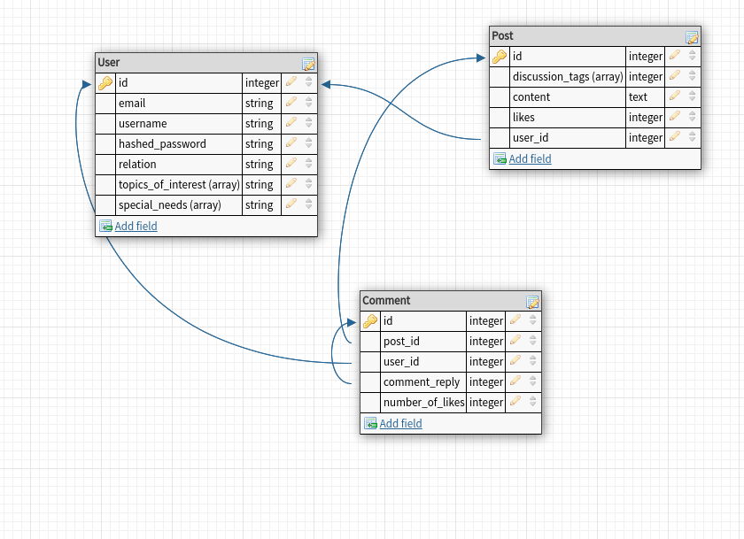
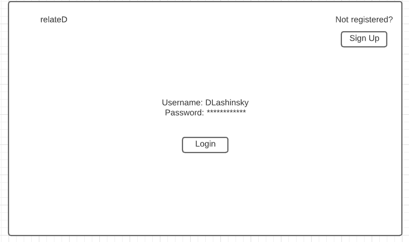
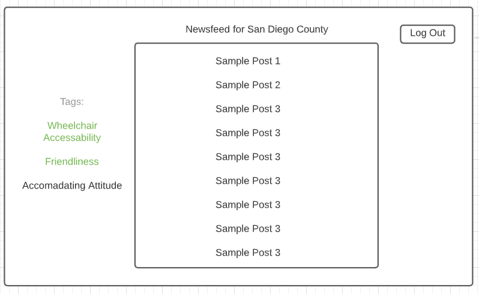

App name

# RelateD

## Description

In a recent study from the CDC, 1 in 4 Americans suffer from some sort of physical or mental disability.  15%, or approximately 1 billion people worldwide are also disabled in some sort of way.

Day-to-day living for these people is much more taxing than it is for a person who does not have a particular disability or special need making their particular expereinces, desires and needs acute.  Additionaly many times the families of these people are the ones who take care of disabled folks, and especially parents of children who have disabilites and/or special needs.  Outside of routine medical support from doctors as well as other medical professionals tasked at aiding in the particular special need, it is difficult to find others who understand the acute struggles, needs and experiences they are facing.

This is precisely where relateD comes in: to connect the community of people who have disabilities and special needs with one another.  Considering there are several different types of disabilities and special needs, every subset has acute experiences that are worth sharing with others who are looking simply for support; those who have been/family member has been recently diagnosed searching for general information about the diagnosis/prognosis; looking for information regarding helpful products, businesses, physical locations that are relevant to that need.  Or simply put, connecting two families who experience the similar struggles to bond over it.

RelateD is a one stop shop solution for all communities who have to live with disabilites and/or special needs and are looking for a meaningful connection to a larger community who shares the same experience.

## User Stories

MVP:

* Linking into the local community for persons with similar special needs
* User will be connected to others in their geographical area (county)
* Users can submit topics for discussion with relevant tags
* Users can comment on others posts, like, and reply

Stretch:

* User can view Yelp wheelchair-accessability scores on an interactive map
* User can view top features(locations of top caregivers + PT/OT centers, doctors, childcare centers)

## Group Roles

David: Backend Manager

Justin: Frontend Manager

Henry: Git Manager

## Sprints

Monday:

* Stub routes on backend,
* Stub out Mongoose Schema 
* Backend Manager + Frontend Manager meet to create initial plan for endpoints/integration
* Finalize API decisions for MVP, test API. Make calls.
* Stub out Frontend routes + structure

Tuesday:
* Complete non-API related backend routes. 
* Populate DB With some seeder data
* Test frontend with sample views (sample data)

Wednesday:
* Complete API-related backend routes, test backend functionality
* Complete frontend, test frontend functionality

Thursday:
* Integration Testing Day (Team convenes and ensures that frontend + backend are working in unison)

Friday:
* Style + Stretch

# Backend Routes:

### GET ROUTES
HTTP VERB | URL | Description 
------------ | ------------- | -------------
GET | users/auth-locked/:userId/logout| User clicks logout to logout of their profile.  Deletes/expires JWT token, redirects to login page. (react?)
GET | users/auth-locked/:userId/posts| CRUDs Posts/Discussion Boards database, for all relevant posts corresponding to the user's geographical location (County). (Only preview of post data)
GET | users/auth-locked/:userId/posts/:postId| User clicks on a single post displaying all content, comments, etc. from that particular post
GET | users/auth-locked/:userId/profiles | User clicks on all other user's profiles, sees a preview of other users information. Reads (find) user's collection.  
GET | users/auth-locked/:userId/profiles/:profileId | user clicks on a particular user profile. (from various front end locations/links)  Reads user's collection by Id(findById).

### POST ROUTES
HTTP VERB | URL | Description 
------------ | ------------- | -------------
POST | /login | Reads DB user's collection to find a match. Checks username and password crudentials. (Password Hashing).  Sends JSON, JWT token to front end for user. 
POST | /register | Form located on home page, upon clicking register, CREATEs new data to DB in user's collection. (e.g. username, email, password, location, etc.)
POST | /users/auth-locked/:userId/Posts |  User CREATEs new post in db Posts collection.
POST | /users/auth-locked/:userId/Posts/:postId/comments |  User CREATEs new comment on a particular post in db comments collection.
POST | /users/auth-locked/:userId/Posts/:postId/comments |  User CREATEs new comment on a particular post in db comments collection.
POST | /users/auth-locked/:userId/Posts/:postId/comments/:commentId | user likes a comment (CREATE) a comment by another user or their own comment. (In either a comment join collection?  or Array in comments collection) 

### PUT ROUTES
HTTP VERB | URL | Description 
------------ | ------------- | -------------
PUT | /users/auth-locked/:userId/profiles | User updates/changes something about their profile. (UPDATE)
PUT |/users/auth-locked/:userId/Posts/:postId/comments/:commentId | user can edit/change a comment on a post. (UPDATE)
PUT | /users/auth-locked/:userId/Posts | User edits the content of thier post. (UPDATE)

### DELETE ROUTES
HTTP VERB | URL | Description 
------------ | ------------- | -------------
DELETE | /users/auth-locked/:userId/profiles | User updates/changes something about their profile. 
DELETE |/users/auth-locked/:userId/Posts/:postId/comments/:commentId | user can edit/change a comment on a post. 
DELETE | /users/auth-locked/:userId/Posts | user can edit their posts.

## Database ERD/ Schema

## Technologies and APIs

* Boostrap 
* MERN

APIs:

* zipcodebase.com (zip code --> county mapping), 

Stretch:

* SocketIO 
* Mapbox

## Wireframes

